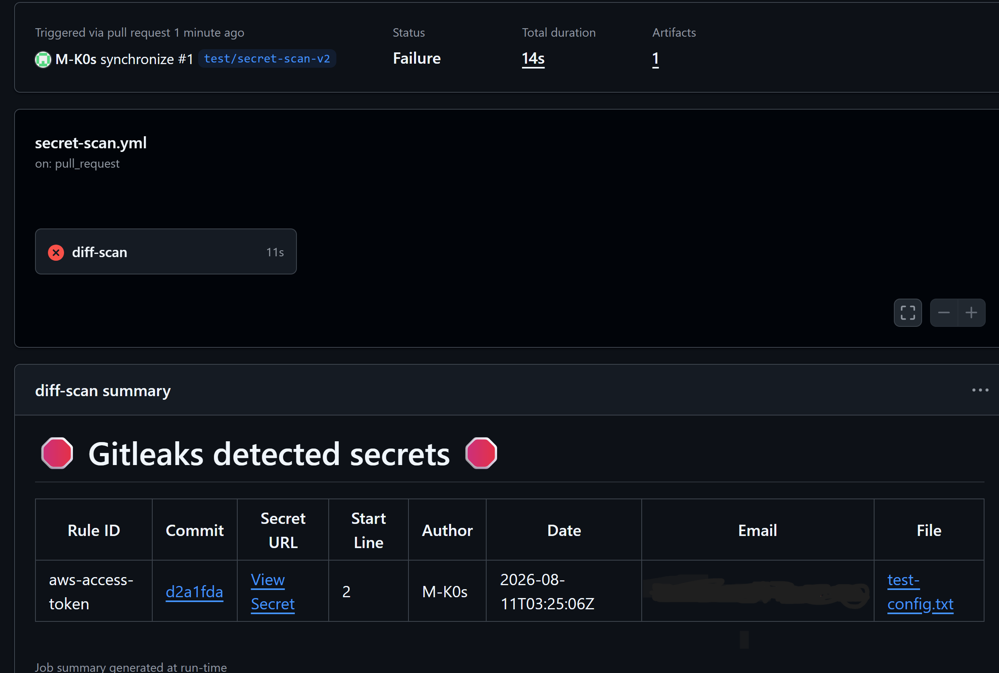

# Secure Deploy Kit

Someone on your team pushes code with a hardcoded API key. Nobody
notices — the deploy goes fine, everything works. Three months later,
the repo goes public, or someone with access forks it, and that key is
still sitting there, in the history, waiting to be found. Your team
knows how to ship code. Nobody has the time, or the role, to audit
this by hand.

## What this does

A GitHub Actions workflow that scans every Pull Request for hardcoded
credentials (AWS keys, GitHub tokens, etc.) before they reach your
main branch. If it finds something, the check fails and shows you the
exact file, line, and commit.

## Proof

The check catching a test secret in a real PR:

## Installation

1. In your repo, create the folder `.github/workflows/` if it doesn't
   exist yet
2. Download [`secret-scan.yml`](.github/workflows/secret-scan.yml) from
   this repo and place it inside that folder
3. Commit and push to any branch
4. Open a Pull Request — the check runs automatically and blocks the
   merge if it finds a hardcoded secret

No extra configuration needed for the basic case. GitHub Actions
detects any `.yml` file in `.github/workflows/` on its own.

## What this does NOT do

- Doesn't scan your full repo history on every PR (only the diff) —
  that's a separate weekly audit job
- Doesn't rotate or revoke leaked secrets automatically — if it finds
  one, rotating it is still on you
- Doesn't replace a secrets manager (Vault, AWS Secrets Manager, etc.)
  — it only stops credentials from reaching the repo

## Design decisions

See [DECISIONS.md](DECISIONS.md).
