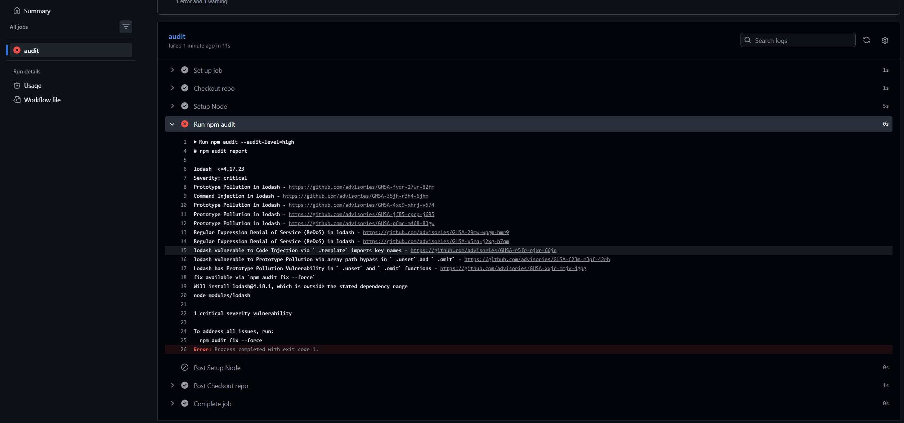

# Secure Deploy Kit

Someone on your team pushes code with a hardcoded API key. Nobody
notices — the deploy goes fine, everything works. Three months later,
the repo goes public, or someone with access forks it, and that key is
still sitting there, in the history, waiting to be found. Your team
knows how to ship code. Nobody has the time, or the role, to audit
this by hand.

The same goes for dependencies: a library with a known critical
vulnerability gets added in month one, nobody updates it, and eight
months later that CVE is public and your `package.json` is sitting
right there in the repo.

## Checks included

- **`secret-scan.yml`** — scans every Pull Request for hardcoded
  credentials (AWS keys, GitHub tokens, etc.) and blocks the merge if
  it finds one, showing the exact file, line, and commit.
- **`dependency-check.yml`** — runs `npm audit` on every Pull Request
  and blocks the merge if it introduces a dependency with a known
  `high` or `critical` vulnerability.
- **`dependabot.yml`** — keeps your existing dependencies patched over
  time, independent of any single PR. Opens a PR automatically when a
  fix is available for something you already have installed.

## Proof

`secret-scan` catching a test secret in a real PR:

`dependency-check` catching a known critical vulnerability in a test
dependency:

## Installation

1. In your repo, create the folder `.github/workflows/` if it doesn't
   exist yet
2. Download the workflow(s) you want from this repo —
   [`secret-scan.yml`](.github/workflows/secret-scan.yml),
   [`dependency-check.yml`](.github/workflows/dependency-check.yml) —
   and place them inside that folder
3. For dependency scanning, also copy
   [`dependabot.yml`](.github/dependabot.yml) into `.github/` directly
   (not into `.github/workflows/`)
4. Commit and push to any branch
5. Open a Pull Request — the checks run automatically and block the
   merge if they find a problem

No extra configuration needed for the basic case. GitHub Actions
detects any `.yml` file in `.github/workflows/` on its own, and
Dependabot picks up `.github/dependabot.yml` the same way.

## What this does NOT do

- Doesn't scan your full repo history on every PR (only the diff) —
  that's a separate weekly audit job, not included yet
- Doesn't rotate or revoke leaked secrets automatically — if it finds
  one, rotating it is still on you
- Doesn't replace a secrets manager (Vault, AWS Secrets Manager, etc.)
  — it only stops credentials from reaching the repo
- `dependency-check` only covers npm/Node projects for now — no Python
  or other ecosystems yet
- Doesn't auto-fix vulnerable dependencies — it blocks the PR and
  tells you what to upgrade, but the upgrade itself is manual (or
  handled separately by Dependabot's own PRs)

## Design decisions

See [DECISIONS.md](DECISIONS.md).